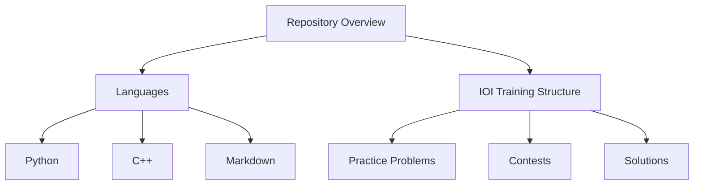

```mermaid
graph TD;
    A[Repository Overview] --> B[Languages];
    B --> C[Python];
    B --> D[C++];
    B --> E[Markdown];
    A --> F[IOI Training Structure];
    F --> G[Practice Problems];
    F --> H[Contests];
    F --> I[Solutions];
```