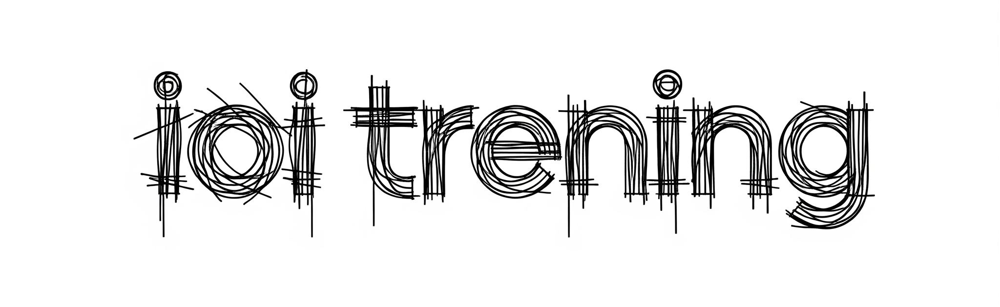

<div align="center">




<p><strong>Advanced Repository for Algorithmic Problem Solving</strong></p>

<div>
  
  
  
  
  
</div>

<!-- thin animated bar -->


</div>

<br />


## 1. Project Overview

This repository serves as a centralized archive of source codes for algorithmic problems from prestigious competitive programming platforms. Each solution is engineered with strict adherence to Time Complexity ($O$) and Space Complexity constraints.

### Platform Classification

<table width="100%">
  <thead>
    <tr>
      <th align="left" width="25%">Category</th>
      <th align="left" width="35%">Source</th>
      <th align="left" width="40%">Objectives</th>
    </tr>
  </thead>
  <tbody>
    <tr>
      <td><b>Olympiads</b></td>
      <td>OIG, OI, IOI</td>
      <td>National and International Informatics Olympiad tasks.</td>
    </tr>
    <tr>
      <td><b>Training</b></td>
      <td>Szkopuł / OIOIOI</td>
      <td>Curated training sets and historical archives.</td>
    </tr>
    <tr>
      <td><b>Competitive</b></td>
      <td>Codeforces</td>
      <td>Solutions for online Division Rounds.</td>
    </tr>
    <tr>
      <td><b>Foundational</b></td>
      <td>CSES Problem Set</td>
      <td>Reference implementations for core algorithms.</td>
    </tr>
  </tbody>
</table>


## 2. Technical Stack & Methodology

The project focuses on high-performance implementations utilizing modern C++ standards and advanced algorithmic techniques:

* **Data Structures**: Segment Trees (Lazy Propagation), Fenwick Trees, Lowest Common Ancestor (LCA), Disjoint Set Union (DSU).
* **Graph Theory**: Shortest Path Algorithms (Dijkstra, Bellman-Ford), Flow Networks, Traversal (BFS, DFS).
* **Optimization**: Dynamic Programming (Classical & Advanced), Greedy Heuristics, Binary Search on Answer.
* **Standards**: Leveraging C++ STL (Standard Template Library) for memory-efficient computation.


## 3. Compilation & Debugging

Standardized build procedures using the GCC (`g++`) toolchain for Linux-based environments.

### Production Profile (Submission)
Optimized for execution speed and static linking.

```bash
g++ -O3 -static -std=c++17 \
    main.cpp -o solution
./solution < input.txt
Diagnostic Profile (Development)
```

Aggressive error checking for memory safety and undefined behavior.

```bash
g++ -std=c++17 -O2 \
    -Wall -Wextra -Wshadow \
    -fsanitize=address,undefined \
    main.cpp -o diagnostic_build  diagnostic_build
```

<details> <summary><b>Technical Flag Specifications</b></summary> <table width="100%"> <tr> <td width="30%"><code>-Wall -Wextra</code></td> <td>Enables a comprehensive set of compiler warnings for code quality.</td> </tr> <tr> <td><code>-Wshadow</code></td> <td>Detects instances where local variables shadow outer scopes.</td> </tr> <tr> <td><code>-fsanitize=address</code></td> <td>Runtime memory error detector (out-of-bounds, use-after-free).</td> </tr> <tr> <td><code>-fsanitize=undefined</code></td> <td>Identifies non-portable or undefined behavior (UB) in C++.</td> </tr> </table> </details>


## 4. Supplementary Information

>[!IMPORTANT]
>*Project Intent*
>This repository is for educational and documentation purposes. Certain implementations may follow contest-style coding practices (high-speed drafting) rather than enterprise software patterns.

>[!TIP]
>*Contributions & Optimization*
>If you identify logic errors or potential complexity optimizations, please open a formal Issue or submit a Pull Request.

<div align="center">
 <br/> <!-- bottom wave -->  </div> 